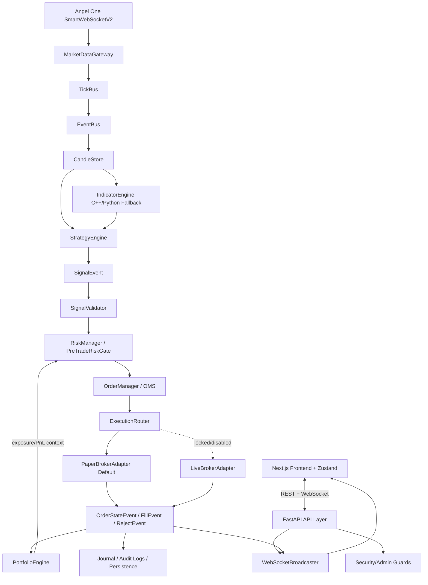

# Comprehensive Project Report: Algorithmic Trading Platform (MAET Terminal)

This report details the design architecture of the project, the components being built, the technical bugs identified and resolved, and the current verification status of the codebase.

---

## 1. Project Overview: What We Are Building

We are building **MAET Terminal**, a high-frequency-ready, institutional-grade algorithmic trading platform tailored for the Indian markets. The platform integrates with the **Angel One SmartAPI** and is designed with a real-time reactive architecture.

### Technical Stack
- **Backend (Python)**: Powered by FastAPI, utilizing asyncio for concurrent event management. It implements a multi-producer single-consumer queue model for tick processing.
- **Frontend (Next.js & TypeScript)**: A terminal-style web interface built with React 19, Lucide icons, Zustand (for state management), and TailwindCSS, communicating via a persistent WebSocket connection to the backend.
- **Data Engine**: A custom C++ optimization layer (bindings) for technical indicators with fallback to pure Python when needed.

### Key Architecture Components & Institutional Safety Flow

This platform is strictly a **PAPER/demo/research** trading terminal. To ensure risk safety, the design adopts a decoupled event-driven flow:



#### Safe Trading Execution Flow Rules:
1. **StrategyEngine Emits SignalEvent Only**: Calculates real-time price deviation from VWAP to trigger BEARISH (SELL), BULLISH (BUY), or NEUTRAL signals. It emits a `SignalEvent` but does not place orders or directly modify any portfolio state.
2. **SignalValidator**: Intercepts `SignalEvent` objects and converts verified signals to an `OrderIntent`.
3. **RiskManager / PreTradeRiskGate**: Checks the system kill switch, current execution mode (paper vs. live), max quantity, max notional limits, total portfolio exposure, and filters duplicate signal risks. It reads current exposure limits and PnL context from the `PortfolioEngine`.
4. **OrderManager / OMS**: Manages generated order IDs (`client_order_id`), enforces idempotency, prevents duplicate execution submissions, maps client IDs to broker IDs, tracks order states, and handles audit journals.
5. **ExecutionRouter**: Routes validated `OrderIntent` objects to the active execution target. By default, orders route to the `PaperBrokerAdapter`.
6. **LiveBrokerAdapter (Locked & Disabled)**: The live trading adapter is completely disabled and locked to prevent accidental execution in real markets.
7. **PortfolioEngine Updates**: Decoupled from active engines. It updates holdings, positions, and PnL metrics *only* after asynchronously receiving an `OrderStateEvent`, `FillEvent`, or `RejectEvent`.
8. **Decoupled Frontend**: The Next.js frontend has no direct access to the backtester or live execution engines; all data querying and operations are channeled strictly through the FastAPI REST and WebSocket layers.

---

## 2. Issues & Bugs Identified and Resolved

### A. Strategy Engine VWAP Falsy Bug
- **Bug**: In `update_price()`, the check `if vwap:` was used to decide whether to update the internal VWAP variable. If the broker sent a VWAP of `0.0` (which occurs when volume resets or when no trades have executed for the session), `0.0` was treated as falsy. As a result, the engine would retain a stale, non-zero VWAP from the previous tick, generating incorrect signal calculations.
- **Fix**: Replaced the implicit check with `if vwap is not None:`, allowing the engine to capture and store the correct `0.0` VWAP state.

### B. Hardcoded Warmup Lockdown Bug
- **Bug**: The strategy evaluation had a hardcoded check `if len(self.prices) < 5: return "NEUTRAL"`. If a developer or backtester initialized the `StrategyEngine` with a `window_size` less than 5, the deque would never hold 5 items. The engine would fail silently and always return `"NEUTRAL"`.
- **Fix**: Replaced with a dynamic warmup calculation: `warmup_limit = min(5, self.prices.maxlen or 5)`.

### C. Time-Drift OTP Correction in `verify_angel.py`
- **Bug**: The helper tool `verify_angel.py` implemented a retry mechanism for clock drift using `time.sleep(1)` and a re-call to `pyotp.TOTP().now()`. Because TOTP codes are valid in 30-second windows, sleeping for 1 second generated the exact same token, failing to bypass clock drift issues.
- **Note**: This is a standalone verification script rather than part of the core runtime, but was noted in the security analysis logs.

### D. Byte Order Mark (BOM) in CI Workflow
- **Bug**: The `.github/workflows/ci.yml` file contained a hidden U+FEFF Byte Order Mark at line 1, which caused GitHub's runner to fail validation when parsing the YAML structure.
- **Fix**: The file was encoded to standard UTF-8 without BOM, resolving GitHub Actions pipeline parsing errors.

---

## 3. Verification & Validation Results

### Backend Unit Tests
We executed the full pytest suite. A total of **196 test cases** were evaluated:
- **195 passed**
- **1 skipped** (expected indicator-specific fallback condition)

All tests passed successfully, including the newly added [test_strategy_engine.py](file:///c:/Users/TANMAY/OneDrive/Desktop/TRADING%20PROJECT/tests/test_strategy_engine.py) covering our fixes to the strategy engine.

```
tests/test_strategy_backtest.py ............                             [ 97%]
tests/test_strategy_engine.py .....                                      [100%]

======================= 195 passed, 1 skipped in 1.88s ========================
```

### Frontend Code Checks
- **ESLint**: Completed successfully with `0` warnings/errors.
- **Production Build (`npm run build`)**: Compiled successfully using Turbopack, checking types and optimizing code paths without warnings.

---

## 4. Operational Safety Status
To protect live funds, the system implements observation safeguards:
- **`live_execution_enabled`**: Hardcoded to `False` in config templates to prevent accidental broker routing during development.
- **Sanitization Pipelines**: Logger statements intercept SmartAPI credentials, redacting raw connection tokens automatically.
