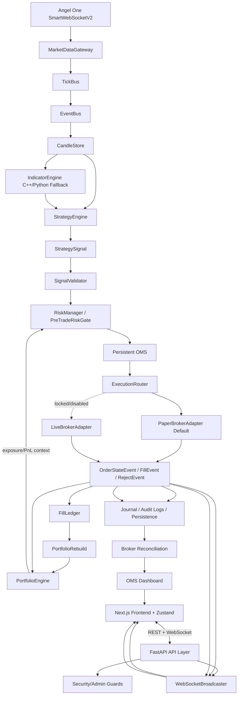

# MAET Terminal Architecture

MAET Terminal is a staged broker-terminal and algorithmic trading platform for Indian markets. The current system uses a Python FastAPI backend, Angel One SmartAPI integration, a typed internal event backbone, and a Next.js terminal frontend.

## Architecture Overview



### Safe Trading Flow
1. **StrategyEngine emits SignalEvent only**: It calculates indicators and price deviations, emitting raw signals (BUY/SELL/NEUTRAL) rather than executing trades or updating portfolios directly.
2. **SignalValidator**: Intercepts `SignalEvent` and converts approved strategy signals into an `OrderIntent`.
3. **RiskManager / PreTradeRiskGate**: Checks validation rules such as the global kill switch status, current trading mode (paper vs. live), max order quantity, max order notional, current exposure limits, and duplicate order risk. It uses state context from the `PortfolioEngine` for exposure and PnL metrics.
4. **OrderManager / OMS**: Owns the lifecycle of order execution, client-side order ID (`client_order_id`) generation, idempotency, duplicate prevention, broker order ID mapping, order status transitions, and audit logs.
5. **ExecutionRouter**: Routes validated `OrderIntent` objects. By default, orders are routed to the `PaperBrokerAdapter`.
6. **LiveBrokerAdapter (Locked/Disabled)**: The live trading adapter is completely disabled and locked to prevent accidental execution in real markets.
7. **PortfolioEngine updates after events only**: The portfolio is decoupled from order routing and updates its positions, holdings, and PnL metrics *only* when it receives an asynchronous `OrderStateEvent`, `FillEvent`, or `RejectEvent`.
8. **Decoupled Frontend**: The Next.js frontend never communicates directly with the internal backtesting or execution engines; all data and status queries flow strictly through the FastAPI REST/WebSocket API layer.

## Event Pipeline

```text
SmartAPI -> SmartWebSocketV2 -> Normalized Ticks -> TickBus -> EventBus
  -> CandleStore -> IndicatorEngine -> StrategyEngine -> SignalEvent
  -> SignalValidator -> RiskManager -> OrderManager -> ExecutionRouter -> PaperBrokerAdapter
  -> FillEvent/OrderStateEvent -> PortfolioEngine -> WS Broadcaster -> Frontend UI
```

Raw broker tick payloads are normalized inside the gateway before reaching downstream modules.

## Module Dependency List

- `backend/core/config.py`: centralized environment-backed settings.
- `backend/core/session_manager.py`: safe async SmartAPI session lifecycle.
- `backend/core/session_watchdog.py`: background session refresh loop.
- `backend/core/events.py`: typed serializable event models.
- `backend/core/event_bus.py`: async pub/sub event router.
- `backend/core/security.py`: response sanitizer.
- `backend/gateway/instrument_loader.py`: Angel One public instrument master cache loader.
- `backend/gateway/instrument_registry.py`: instrument search/token registry with fallback symbols.
- `backend/gateway/market_gateway.py`: SmartWebSocketV2 gateway and tick normalization.
- `backend/gateway/tick_bus.py`: asyncio queue bridge from WebSocket thread.
- `backend/candles/candle_store.py`: in-memory OHLCV candle store.
- `backend/candles/candle_fetcher.py`: SmartAPI historical candle fetcher.
- `backend/indicators/*`: IndicatorEngine wrapper, optional C++ bridge, and Python fallback calculations.
- `backend/strategy/*`: strategy template metadata and offline backtesting engine for research workflows.
- `backend/execution/*`: order intent, risk gate, routing, paper/live managers, state machine, poller, fees, kill switch.
- `backend/portfolio/*`: position tracker, holdings tracker, equity curve, reconciliation, portfolio engine.
- `backend/routers/*`: API routers for candles, indicators, and portfolio.
- `cpp/*`: deterministic C++17 indicator core and optional `pybind11` binding module.
- `frontend/*`: Next.js trading terminal UI, WebSocket client, REST fallback, market/watchlist/portfolio surfaces.

## Phase Completion Summary

| Phase | Summary |
|---|---|
| Phase 7 | EventBus wiring, candle engine, and chart foundation |
| Phase 8 | Order intent model, execution safety layer, kill switch, risk gate, paper/live parity |
| Phase 9 | Portfolio reconciliation, holdings, PnL, equity curve |
| Phase 9.5 | Frontend portfolio API wiring and cleanup |
| Phase 10 | Vercel frontend and Render backend staging deployment hardening |
| Phase 10A/10B | WebSocket route stabilization, heartbeat, exponential reconnect, REST fallback |
| Phase 11A | Angel One public instrument master loader with fallback registry |
| Phase 11B | Security audit, sanitizer, rate limiting, credential rotation docs |
| Phase 11C | Presentation-ready README, architecture docs, demo-mode banner |
| Phase 12 | C++/Python indicator engine, FastAPI routes, and frontend chart overlays |
| Phase 13A-C | Strategy models, templates, offline backtesting engine, and strategy API routes |

## Market Data Flow

```text
SmartAPI -> SmartWebSocketV2 -> MarketDataGateway -> TickBus -> EventBus -> CandleStore -> WebSocket/REST -> Frontend
```

Market closed periods are expected to produce no live ticks. The WebSocket heartbeat and REST status fallback keep terminal status visible even without tick traffic.

## Execution Safety Flow

```text
StrategySignal -> SignalValidator -> RiskGate -> OMS -> PaperBroker -> FillLedger -> PortfolioRebuild -> OMS Dashboard
```

PAPER mode is the default. LIVE execution is gated and disabled by default. Live broker placement must pass explicit safety checks before any broker call can be made.
The new Trading Safety Engine v1 relies on a persistent SQLite OMS, broker order ID tracking, startup OMS recovery, and a partial fill ledger.

## Portfolio Flow

```text
OrderStateEvent / FillEvent / RejectEvent -> PositionTracker -> PortfolioEngine -> PortfolioEvent -> API/WS -> Frontend
```

PAPER mode treats internal fills and the trade journal as source of truth. LIVE mode is designed to reconcile with broker positions and holdings.

## Phase 12 - Indicator Engine

### C++ Core

The C++ core under `cpp/` performs deterministic C++17 indicator calculations for SMA, EMA, RSI, MACD, ATR, VWAP, and Bollinger Bands. Indicator outputs preserve input length. Values that cannot be computed yet because of insufficient history use NaN internally. The C++ core has no broker dependency and does not read credentials, subscribe to market data, or place orders.

### pybind11 Bridge

The optional native Python module is `maet_cpp_indicators`. It is built with `pybind11` and converts Python price arrays and candle dictionaries into C++ vectors and structs. The bridge is optional; backend import must not depend on it being compiled.

### Python Fallback

`backend.indicators.python_fallback` mirrors the indicator API in pure Python. `IndicatorEngine` selects the C++ bridge when available and automatically falls back to Python when the native module is unavailable. This keeps Render staging and other systems without native builds deployable.

### FastAPI Routes

- `GET /indicators/status`: selected engine and supported indicators.
- `GET /indicators/{symbol}`: CandleStore-backed indicator calculation for a symbol/timeframe.
- `POST /indicators/calculate`: offline indicator calculation from posted arrays.

### Frontend Visualization

The Next.js terminal renders:

- EMA overlay
- VWAP overlay
- Bollinger Bands overlay
- RSI subpanel
- MACD subpanel

### Data Safety

Indicator routes use CandleStore data or explicit request payloads only. They do not fetch broker data, do not place orders, and do not fabricate candles or indicator values. NaN and Infinity values are converted to JSON `null` before responses reach the frontend.

```text
CandleStore
  -> IndicatorEngine
    -> C++ pybind11 or Python fallback
      -> FastAPI JSON response
        -> Zustand store
          -> Chart overlays/subpanels
```

## Phase 13 - Strategy Research

Phase 13 adds the backend foundation for a future Strategy Lab. It is intentionally offline and research-only. Strategy routes do not fetch broker candles, do not call SmartAPI, do not place orders, and do not route signals into the execution layer.

```text
Candles
  -> IndicatorEngine
  -> Strategy Template
  -> BacktestEngine
  -> BacktestResult
  -> Strategy API
  -> Future Strategy Lab frontend
```

### Strategy Templates

Supported templates:

- EMA crossover
- RSI mean reversion
- MACD trend
- VWAP pullback
- Bollinger breakout

Each template exposes metadata, default parameters, required indicators, and `live_execution_enabled: false`.

### Backtest Engine

The backtest engine normalizes posted or cached CandleStore candles, generates long-only BUY/EXIT research signals, simulates fixed-quantity trades, applies simple fee and slippage assumptions, and returns trades, equity points, drawdown, and summary metrics. It does not fabricate candles or performance results.

### Strategy API Routes

- `GET /strategies/status`
- `GET /strategies/templates`
- `POST /strategies/backtest`
- `POST /strategies/signal-preview`

## Deployment Architecture

```text
Vercel
  -> Next.js frontend
  -> NEXT_PUBLIC_API_URL / NEXT_PUBLIC_WS_URL

Render
  -> FastAPI backend
  -> Angel One SmartAPI
  -> WebSocket market stream
```

Render is currently a staging target. Production should move to a persistent VPS/cloud VM with systemd, Nginx, HTTPS/WSS, a persistent database, and a secrets manager.

## Technology Decisions and Rationale

- **FastAPI backend**: async-friendly Python service with clear REST/WebSocket support and enough flexibility for broker integrations.
- **Next.js frontend**: deployable on Vercel with a typed React terminal interface and public runtime configuration through `NEXT_PUBLIC_*` variables.
- **Angel One SmartAPI isolated in backend**: broker credentials and session tokens never enter the browser.
- **SessionManager**: keeps broker login out of import time and stores only safe status in health responses.
- **SmartWebSocketV2 gateway thread + TickBus**: keeps blocking broker WebSocket callbacks away from the asyncio event loop.
- **EventBus**: provides a typed internal backbone for strategy, risk, execution, portfolio, candles, and future C++ bridge integration.
- **CandleStore in memory for now**: enough for live terminal behavior while avoiding fake OHLCV data. Persistent candle storage is a later production step.
- **ExecutionRouter + PreTradeRiskGate**: separates order intent, risk approval, routing, and order state changes so live trading can remain locked.
- **PortfolioEngine**: keeps PAPER portfolio state internal and prepares reconciliation paths for future broker-backed LIVE mode.
- **Render for staging**: quick public backend hosting, with known limitations around sleep and ephemeral storage.
- **VPS/systemd/Nginx later**: required for durable broker sessions, stable WebSocket operation, persistent storage, and production observability.

## Current Limitations

- Render Free sleeps after inactivity.
- SQLite and instrument cache data are ephemeral on Render Free.
- No production authentication yet.
- Market closed means no live ticks.
- The current frontend is a terminal shell, not a full TradingView replacement.
- Live order execution remains disabled by default.
- Strategy routes are offline/research-only and are not connected to live execution.

## Remaining Architecture Roadmap

- Persistent database
- Stronger authentication/user management
- Durable observability stack
- VPS production deployment

## v2.0 Showcase Summary

MAET Terminal v2.0 is a demo-ready full-stack trading research workstation: Next.js frontend on Vercel, FastAPI backend on Render, Angel One SmartAPI market-data integration, WebSocket streaming, event-driven TickBus/EventBus internals, CandleStore, C++/Python indicator engine, offline strategy research, and safety-first PAPER mode.

Production-like parts include the separated frontend/backend architecture, sanitized health/status responses, REST plus WebSocket communication, event-driven backend structure, optional C++ analytics bridge, Python fallback behavior, admin-token protection for sensitive demo routes, and deployment-aware unavailable states.

Demo-only boundaries remain clear: live trading is locked, strategy routes are research-only, Render Free can cold start, persistence is not production-grade, observability is session-scoped, and the project is not financial advice or production trading software.

Optional future work after the v2.0 showcase:

- C++ backtest engine
- C++ screener engine
- PostgreSQL or another durable database
- VPS deployment with process supervision
- Better chart engine
- Auth UI and stronger user management
- Real observability stack
