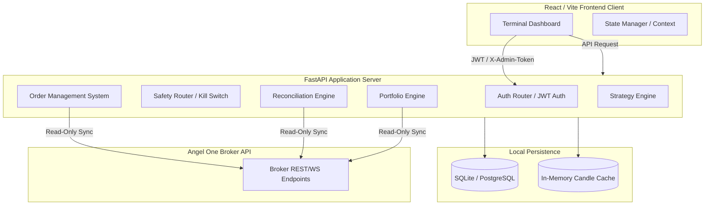

# MAET Terminal — Frontend API Contract

This document specifies the communication contract between the **MAET Terminal Frontend** and the **FastAPI Backend**. It details authentication, state management, safety boundaries, and all integration endpoints required to build the frontend terminal dashboard.

---

## 1. System Architecture & Safety Guarantees



### Key Integration Rules:
1. **Zero Direct Database Access**: The frontend has no direct access to the database. All state must be queried or modified via the REST and WebSocket endpoints.
2. **Absolute Read-Only Sync & Live Execution Lock**: 
   - No mutations of live broker state are allowed by default. 
   - The live execution engine is compiled with `BUILD_LIVE_EXECUTION_ALLOWED = False`. Any call to enable live trading will return a HTTP `403 Forbidden` response.
3. **Sensitive Data Redaction**: The backend automatically filters responses through a sanitization layer. Database URLs, credentials, token secrets, and keys are scrubbed and replaced with `***REDACTED***`.

---

## 2. Authentication Flow

Authentication is session-less and JWT-based. As a fallback/legacy option during testing, a static admin token is supported.

### Auth Endpoints

#### `POST /auth/login`
Authenticates a user and issues a JWT access token.

- **Request Body**:
  ```json
  {
    "username": "admin",
    "password": "your_secure_password"
  }
  ```
- **Response (200 OK)**:
  ```json
  {
    "access_token": "eyJhbGciOiJIUzI1NiIsInR5cCI6IkpXVCJ9...",
    "token_type": "bearer"
  }
  ```
- **Response (401 Unauthorized)**:
  ```json
  {
    "detail": "Invalid username or password"
  }
  ```

#### `POST /auth/logout`
Performs a client-side session destruction. Since authentication is session-less, the frontend must discard the JWT. The backend records a audit log for the logout request.

- **Headers**:
  - `Authorization: Bearer <token>`
- **Response (200 OK)**:
  ```json
  {
    "status": "success",
    "message": "Logged out successfully"
  }
  ```

### Authorization Headers
For all protected endpoints, the frontend must supply one of the following headers:
1. **Bearer Token (Preferred)**:
   `Authorization: Bearer <access_token>`
2. **Legacy Admin Header**:
   `X-Admin-Token: <static_admin_token>`

---

## 3. Safety & Lockdown Endpoints

These endpoints provide real-time status of the platform's execution bounds, risk controls, and automated safety switches.

### `GET /safety/live/status`
Exposes the status of the master kill switch, current execution mode, and policy limits.

- **Headers**: JWT Admin / X-Admin-Token
- **Response (200 OK)**:
  ```json
  {
    "kill_switch": {
      "active": false,
      "triggered_at": null,
      "reason": null,
      "updated_by": null
    },
    "live_trading_enabled": false,
    "execution_mode": "PAPER",
    "broker_mutation_guard": {
      "enabled": true,
      "details": "All place, cancel, modify operations blocked by default"
    },
    "manual_order_policy": {
      "max_quantity": 1,
      "allowed_product_types": ["CNC", "DELIVERY"],
      "allowed_instrument_types": ["EQUITY"],
      "market_orders_dry_run_only": true
    }
  }
  ```

### `GET /safety/monitor/status`
Returns the operational metrics of the background `LiveSafetyMonitor` (e.g. anomaly counts, memory limits, and polling health).

- **Headers**: JWT Admin / X-Admin-Token
- **Response (200 OK)**:
  ```json
  {
    "running": true,
    "last_check_at": "2026-05-26T08:19:00Z",
    "consecutive_anomalies": 0,
    "status": "PASS",
    "metrics": {
      "system_ram_mb": 142.5,
      "cpu_pct": 2.1
    }
  }
  ```

### `POST /safety/monitor/run-checks`
Triggers an immediate, manual evaluation of the safety monitor rules.

- **Headers**: JWT Admin / X-Admin-Token
- **Response (200 OK)**:
  ```json
  {
    "status": "PASS",
    "timestamp": "2026-05-26T08:20:12Z",
    "checked_components": ["RAM", "OMS_LATENCY", "TICK_STABILITY"]
  }
  ```

### `GET /execution/live/status`
Returns the status of the live broker-routing component.

- **Headers**: JWT Admin / X-Admin-Token
- **Response (200 OK)**:
  ```json
  {
    "live_enabled": false,
    "build_allowed": false,
    "mode": "PAPER",
    "status": "LOCKED_DOWN",
    "policy_warning": "BUILD_LIVE_EXECUTION_ALLOWED is configured to False. Live trading is physically locked out."
  }
  ```

### `POST /execution/live/enable`
Attempts to switch the terminal to live market order execution. **This operation is locked out at the compile/build level.**

- **Headers**: JWT Admin / X-Admin-Token
- **Request Body**:
  ```json
  {
    "confirm": true,
    "source": "ADMIN"
  }
  ```
- **Response (403 Forbidden)**:
  ```json
  {
    "detail": "Live execution is disabled by the compilation policy build lock."
  }
  ```

### `POST /execution/live/disable`
Disables live trading and instantly switches the system back to paper-mode/dry-run configuration. **Always returns successfully.**

- **Headers**: JWT Admin / X-Admin-Token
- **Request Body**:
  ```json
  {
    "confirm": true
  }
  ```
- **Response (200 OK)**:
  ```json
  {
    "success": true,
    "live_enabled": false,
    "mode": "PAPER",
    "reason": "Disabled by user command"
  }
  ```

---

## 4. Broker Account Sync & History

The terminal displays account balances, portfolios, and trade details synchronized from the external broker. All endpoints are read-only.

### `GET /broker/account/status`
Returns the connectivity state of the broker API (no private information is returned; safe for public dashboards).

- **Response (200 OK)**:
  ```json
  {
    "status": "OK",
    "is_valid": true,
    "auth_token_available": true,
    "feed_token_available": true,
    "last_error": null,
    "last_refresh": "2026-05-26T08:15:30Z"
  }
  ```

### `GET /broker/account/snapshot`
Aggregates funds, positions, and holdings from the broker.

- **Headers**: JWT Admin / X-Admin-Token
- **Response (200 OK)**:
  ```json
  {
    "client_id": "T12345",
    "funds": {
      "net_available": 150000.5,
      "collateral": 0.0
    },
    "positions": [],
    "holdings": [],
    "cached_at": "2026-05-26T08:21:00Z"
  }
  ```

### `POST /broker/history/import`
Triggers an asynchronous fetch of past orders and trades from the broker. Saves and merges this data locally.

- **Headers**: JWT Admin / X-Admin-Token
- **Response (200 OK)**:
  ```json
  {
    "status": "SUCCESS",
    "metadata": {
      "imported_orders_count": 42,
      "imported_trades_count": 18,
      "merged_at": "2026-05-26T08:22:15Z"
    }
  }
  ```

### `GET /broker/history/trades`
Retrieves the list of merged, deduplicated trades from the local history cache.

- **Headers**: JWT Admin / X-Admin-Token
- **Response (200 OK)**:
  ```json
  [
    {
      "trade_id": "T-2026-103",
      "symbol": "SBIN-EQ",
      "exchange": "NSE",
      "side": "BUY",
      "quantity": 10,
      "price": 820.45,
      "executed_at": "2026-05-25T14:30:15Z"
    }
  ]
  ```

### `POST /broker/history/pnl/snapshot`
Calculates the current unrealized portfolio PnL based on latest broker position structures and Last Traded Price (LTP).

- **Headers**: JWT Admin / X-Admin-Token
- **Response (200 OK)**:
  ```json
  {
    "status": "SUCCESS",
    "report": {
      "snapshot_id": "snap-9872",
      "calculated_at": "2026-05-26T08:23:00Z",
      "total_unrealized_pnl": 1250.75,
      "positions_evaluated": 3
    }
  }
  ```

---

## 5. Manual Order Ticket (Dry-Run Validation)

The UI's Order Ticket form must display ticket validation results without actually routing orders.

### `POST /manual-order/validate`
Validates a mock order ticket structure against pre-trade risk controls and instrument specifications.

- **Headers**: JWT Admin / X-Admin-Token
- **Request Body**:
  ```json
  {
    "symbol": "TATASTEEL-EQ",
    "exchange": "NSE",
    "side": "BUY",
    "quantity": 1,
    "product_type": "CNC",
    "order_type": "MARKET"
  }
  ```
- **Response (200 OK)**:
  ```json
  {
    "ticket_id": "TKT-4927",
    "symbol": "TATASTEEL-EQ",
    "exchange": "NSE",
    "side": "BUY",
    "quantity": 1,
    "product_type": "CNC",
    "order_type": "MARKET",
    "price": 164.8,
    "estimated_notional": 164.8,
    "status": "VALIDATED",
    "validation_summary": {
      "risk_check": "PASSED",
      "funds_check": "PASSED"
    },
    "rejection_reason": null,
    "validation_only": true,
    "dry_run": true,
    "live_execution_enabled": false,
    "broker_mutation_allowed": false,
    "creates_fill": false,
    "creates_broker_order": false
  }
  ```

---

## 6. Reconciliation Protocols

Allows the operator to detect out-of-sync states between the in-memory OMS, local SQLite database, and the external broker API.

| Endpoint | Method | Role | Protection | Description |
|---|---|---|---|---|
| `/reconciliation/tradebook/status` | GET | Read Status | Admin JWT | Retrieves timestamp and results of the latest trade book reconciliation. |
| `/reconciliation/tradebook/run` | POST | Execute Recon | Admin JWT | Pulls the broker trade book, compares against internal order fill database, generates discrepancies report. |
| `/reconciliation/account/status` | GET | Read Status | Admin JWT | Returns status of the last account reconciliation report. |
| `/reconciliation/account/run` | POST | Execute Recon | Admin JWT | Runs margin/cash and holdings audit against broker. |
| `/portfolio/reconcile/orders` | POST | Execute Recon | Admin JWT | Reconciles open in-memory database states with live broker orders. |

---

## 7. Order Management System (OMS) Visibility

Enables inspection of orders, fills, and internal database tables. All are read-only admin routes.

### `GET /oms/status`
Returns an overview of the OMS, system statistics, and startup database rebuild reports.

- **Headers**: JWT Admin / X-Admin-Token
- **Response (200 OK)**:
  ```json
  {
    "oms": {
      "initialized": true,
      "total_orders_tracked": 128,
      "active_orders_count": 0
    },
    "in_memory_active_orders": 0,
    "portfolio_rebuild": {
      "fills_processed": 105,
      "skipped_rows": 0,
      "rebuilt_positions": ["SBIN-EQ", "INFY-EQ"],
      "warnings_count": 0,
      "source": "database",
      "last_rebuild_at": "2026-05-26T08:00:00Z"
    },
    "trading_mode": "PAPER"
  }
  ```

### `GET /oms/orders/recent?limit=50`
Retrieves a list of recent order requests recorded by the local engine.

- **Headers**: JWT Admin / X-Admin-Token
- **Response (200 OK)**:
  ```json
  {
    "orders": [
      {
        "request_id": "REQ-7821-A",
        "symbol": "SBIN-EQ",
        "side": "BUY",
        "quantity": 1,
        "price": 820.0,
        "status": "REJECTED",
        "created_at": "2026-05-26T08:10:00Z"
      }
    ],
    "count": 1,
    "limit": 50
  }
  ```

### `GET /oms/orders/{request_id}/audit`
Retrieves the full lifecycle history of a specific order (including state changes and partial fills).

- **Headers**: JWT Admin / X-Admin-Token
- **Response (200 OK)**:
  ```json
  {
    "order": {
      "request_id": "REQ-7821-A",
      "symbol": "SBIN-EQ",
      "side": "BUY"
    },
    "events": [
      {
        "event_id": "EVT-102",
        "from_state": "PENDING",
        "to_state": "REJECTED",
        "timestamp": "2026-05-26T08:10:01Z"
      }
    ],
    "fills": []
  }
  ```

---

## 8. Strategy Management & Signals

Endpoints to configure backtests, view strategy templates, configure automated paper-trading runs, and inspect generated trading signals.

### Available Technical Strategies
The terminal supports the following technical strategy templates:
1. `EMA_CROSSOVER` (Exponential Moving Average cross)
2. `RSI_MEAN_REVERSION` (Relative Strength Index bounds reversion)
3. `MACD_TREND` (Moving Average Convergence Divergence trend following)
4. `VWAP_PULLBACK` (Volume Weighted Average Price crossover and mean reversion)
5. `BOLLINGER_BREAKOUT` (Bollinger Bands price breakouts)

### Strategy Endpoints

#### `GET /strategies/templates`
Retrieves configurations, standard default parameters, and schemas for the supported strategy models.

- **Response (200 OK)**:
  ```json
  {
    "templates": [
      {
        "strategy_name": "EMA_CROSSOVER",
        "parameters": {
          "fast_ema": 9,
          "slow_ema": 21
        }
      }
    ]
  }
  ```

#### `POST /strategies/backtest`
Executes a historical backtest of a strategy on a candle dataset.

- **Headers**: JWT Admin / X-Admin-Token
- **Request Body**:
  ```json
  {
    "strategy_name": "EMA_CROSSOVER",
    "symbol": "SBIN-EQ",
    "timeframe": "1m",
    "params": {
      "fast_ema": 9,
      "slow_ema": 21
    },
    "initial_capital": 100000.0,
    "quantity": 10,
    "slippage_bps": 2.0,
    "fee_bps": 3.0
  }
  ```
- **Response (200 OK)**:
  ```json
  {
    "total_trades": 12,
    "net_profit": 1540.2,
    "percent_return": 1.54,
    "win_rate": 0.58,
    "equity_curve": [
      {"time": "2026-05-26T08:00:00Z", "equity": 100000.0},
      {"time": "2026-05-26T08:30:00Z", "equity": 101540.2}
    ]
  }
  ```

#### `GET /strategies/configs`
Retrieves all configured strategies registered in the system database for automated signal checking.

- **Response (200 OK)**:
  ```json
  [
    {
      "id": 1,
      "name": "SBIN Crossover",
      "template_id": "EMA_CROSSOVER",
      "symbols": ["SBIN-EQ"],
      "timeframe": "1m",
      "parameters": {
        "fast_ema": 9,
        "slow_ema": 21
      },
      "status": "ACTIVE",
      "mode": "PAPER",
      "auto_paper_enabled": true,
      "evaluation_interval_seconds": 60,
      "last_evaluated_at": "2026-05-26T08:24:00Z",
      "next_evaluation_at": "2026-05-26T08:25:00Z",
      "max_signals_per_day": 10,
      "cooldown_seconds": 300
    }
  ]
  ```

---

## 9. WebSocket Real-Time Channels

For real-time terminal updates, a WebSocket endpoint is provided.

### WebSocket Connection
- **URL**: `ws://localhost:8000/ws/terminal`
- **Query Params**: `token=<access_token>` or `admin_token=<admin_token>`

### Supported Message Subscriptions
Once connected, the frontend sends JSON subscription messages:
```json
{
  "action": "subscribe",
  "streams": ["ticks:SBIN-EQ", "orders", "reconciliation"]
}
```

### Server-to-Client Broadcasts
The server broadcasts tick updates, order updates, and safety alerts in real time:

#### Tick Update Broadcast (`ticks:<symbol>`)
```json
{
  "stream": "ticks:SBIN-EQ",
  "data": {
    "symbol": "SBIN-EQ",
    "ltp": 820.45,
    "timestamp": "2026-05-26T08:25:00.123Z",
    "volume": 1250
  }
}
```

#### Order Event Broadcast (`orders`)
```json
{
  "stream": "orders",
  "data": {
    "request_id": "REQ-7821-A",
    "status": "REJECTED",
    "reason": "PRE_TRADE_RISK_LIMIT_EXCEEDED"
  }
}
```
